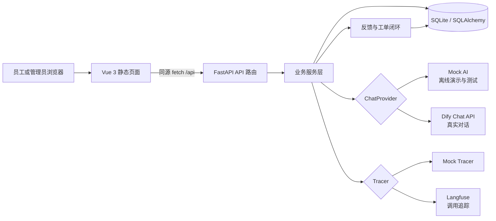
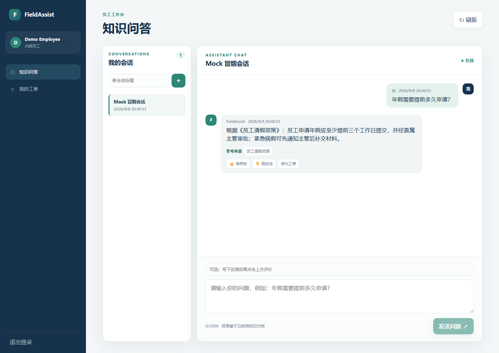
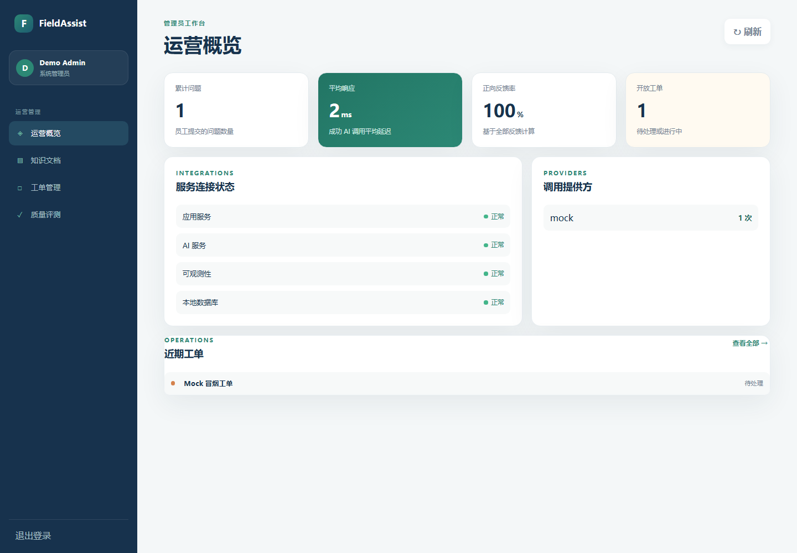
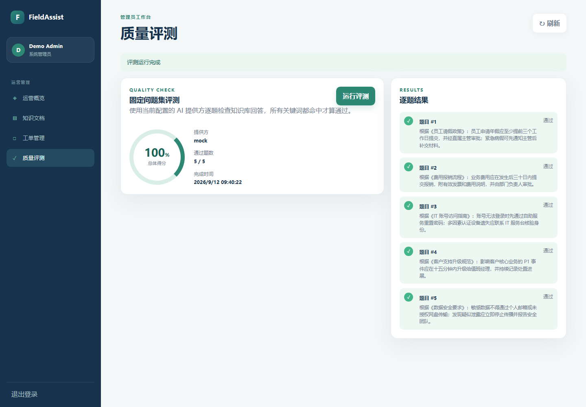

# FieldAssist

FieldAssist 是一个面向企业内部的知识助手和工单工作台。员工可以登录、向知识库提问、查看引用、评价回答并创建工单；管理员可以查看调用指标、集成健康状态、知识文档、工单和固定评测结果。

第一版重点是可交付的业务应用层：FieldAssist 自己负责用户、会话、权限、反馈、工单和本地指标；Dify 负责真实 AI 对话；Langfuse 负责可观测性；没有外部凭据时，Mock 模式提供确定性、离线、可测试的回答。

## 项目定位

FieldAssist 面向企业内部知识问答和问题闭环处理，把“查知识、看依据、评价回答、转成工单、管理员复盘”放在同一个工作台中。项目重点展示 AI 应用交付中的几个实际问题：外部模型服务如何替换、回答如何留下来源、调用如何观测、失败如何降级，以及业务权限和工单流程如何落地。

## 主要能力

- 员工端：登录、知识问答、引用来源、回答反馈、会话历史和转工单。
- 管理端：运营指标、集成健康检查、知识文档、工单管理和固定问题集评测。
- AI 集成：Dify Chat API 真实适配器和无需密钥的确定性 Mock 适配器。
- 可观测性：Langfuse 追踪适配器和本地 `ai_runs` 调用记录，外部追踪失败不阻断业务回答。
- 交付方式：Vue 3 浏览器构建版静态页面、FastAPI 同源接口、SQLite 本地数据和 Docker Compose 配置。

## 架构图



完整的组件边界和降级策略见[架构说明](docs/architecture.md)，可编辑的 Mermaid 源文件见 [`docs/architecture.mmd`](docs/architecture.mmd)。

## 页面截图

以下截图均来自本地 Mock 模式，使用项目自带演示数据，不代表线上生产数据。

| 员工端知识问答 | 管理员运营概览 |
| --- | --- |
|  |  |

| 管理员质量评测 |
| --- |
|  |

## 验证结果

- `pytest tests -q`：111 项测试通过。
- `python -m compileall backend tests`：Python 语法检查通过。
- `node --check frontend/app.js`：前端 JavaScript 语法检查通过。
- Mock 冒烟流程覆盖健康检查、登录、问答、反馈、工单、管理员概览和质量评测。

这些结果用于本地交付验证；项目没有把 Mock 数据、论文中的预期指标或未部署的外部服务写成生产成果。

## 3 分钟启动 Mock 模式

需要 Python 3.10+。在项目根目录执行：

```powershell
python -m venv .venv
.\.venv\Scripts\python.exe -m pip install -r requirements.txt
.\.venv\Scripts\python.exe backend\seed.py
.\.venv\Scripts\python.exe backend\run.py
```

打开 <http://127.0.0.1:8000/>。Mock 模式不需要 Dify、Langfuse、n8n 或模型密钥；默认端口是 `8000`，SQLite 文件会放在 `database/fieldassist.db`。

演示账号：

- 员工：`employee@fieldassist.local`
- 管理员：`admin@fieldassist.local`
- 演示密码请在本机 `.env` 中通过 `DEMO_ADMIN_PASSWORD` 设置；示例文件中的值只是占位符，禁止提交真实密码

若本机不能访问 Vue CDN，可将 Vue 3 浏览器构建文件放入 `frontend/vendor/`，再把 `frontend/index.html` 中的 CDN 地址替换为本地文件；项目本身不需要 Node.js、Vite 或打包步骤。

## 真实 Dify / Langfuse 模式

复制 `.env.example` 为本地 `.env`，只在本机填写真实值：

```dotenv
APP_ENV=development
SECRET_KEY=replace-with-a-strong-local-secret
DATABASE_URL=sqlite:///./database/fieldassist.db
AI_PROVIDER=dify
OBSERVABILITY_PROVIDER=langfuse
DIFY_BASE_URL=https://your-dify-host
DIFY_API_KEY=your-dify-app-api-key
DIFY_APP_ID=your-dify-app-id
LANGFUSE_PUBLIC_KEY=your-langfuse-public-key
LANGFUSE_SECRET_KEY=your-langfuse-secret-key
LANGFUSE_BASE_URL=https://cloud.langfuse.com
REQUEST_TIMEOUT_SECONDS=15
DEMO_ADMIN_PASSWORD=change-me
```

Dify API Key 和 Langfuse Secret Key 只由后端读取，前端不会返回或保存它们。Langfuse 上报失败不会让成功的 AI 回答失败；Dify 超时、认证失败和不可用会转换为中文提示并记录本地失败调用。第一版不依赖 n8n，工单先保存到 SQLite。

## 常用命令

```powershell
.\.venv\Scripts\python.exe -m pytest tests -q
docker compose config
docker compose up --build
```

停止 Compose 使用 `Ctrl+C`。容器通过 `./database:/app/database` 保留 SQLite 数据，并以非 root 用户运行。不要提交 `.env`、API Key、Langfuse Secret Key、数据库文件、`.venv`、缓存或日志。

## 项目结构

```text
backend/app/       FastAPI、SQLAlchemy、认证、业务服务和外部适配器
frontend/          Vue 3 浏览器构建版静态页面
database/          SQLite 数据目录
tests/             pytest 自动化测试
docs/              架构、接口、演示、运行手册和简历素材
```

进一步阅读：

- [架构说明](docs/architecture.md)
- [接口说明](docs/api.md)
- [3–5 分钟演示脚本](docs/demo-script.md)
- [运行手册](docs/runbook.md)
- [简历素材](docs/resume.md)
- [AI 智能面试平台](https://github.com/curry-30-wang/ai-interview-platform)
- [.NET 办公数据工具](https://github.com/curry-30-wang/asphalt-plant-manager)
- [n8n 后续扩展](docs/n8n-extension.md)
